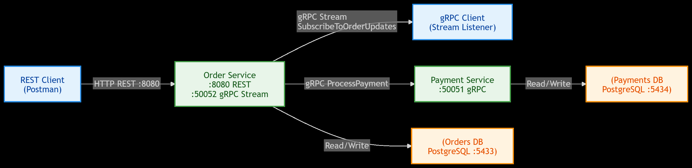
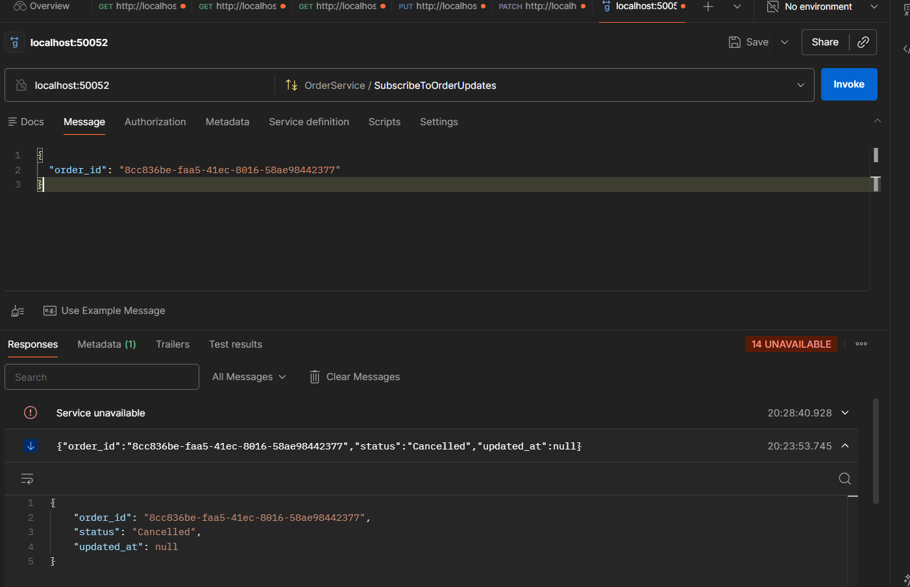
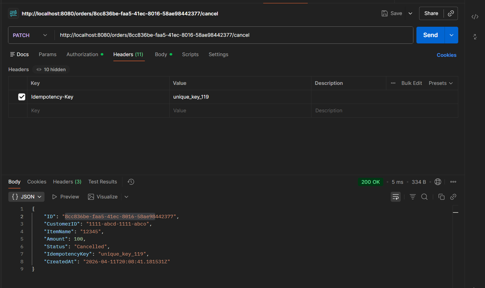

# AP2 Assignment — Order & Payment Microservices (gRPC & Streaming)

Two microservices built with Go, Gin, and PostgreSQL, now communicating via **gRPC** and using a **Contract-First** approach.

## 🔗 Proto Repositories (Deliverable 2)

- **Repo A (Protos):** https://github.com/Metsuk1/ProtocolAP2
- **Repo B (Generated):** [https://github.com/Metsuk1/AP2_Generated](https://github.com/Metsuk1/AP2_Generated) - *automatically published by GitHub Actions*

## 🏗️ Architecture (Deliverable 3)



## 🚀 How to Run

1. **Start Databases:**
```bash
docker-compose up -d
```

2. **Setup Configurations:**
Ensure `.env` files exist in both `order-service` and `payment-service` with appropriate `DB_*` and `GRPC_PORT` variables.

3. **Run Payment Service (gRPC Server):**
```bash
cd payment-service
go run cmd/payment-service/main.go
# Starts on :50051
```

4. **Run Order Service (REST + gRPC StreamServer):**
```bash
cd order-service
go run cmd/order-service/main.go
# REST starts on :8080, gRPC server on :50052
```

##  Testing the gRPC Streaming 

To demonstrate Server-side Streaming (Order Tracking):
1. **Run the Streaming Client** in a separate terminal:
   ```bash
   cd order-service
   go run cmd/test-client/main.go <ORDER_ID>
   ```
2. **Trigger a status update** via Postman REST API:
   ```http
   PATCH http://localhost:8080/orders/<ORDER_ID>/cancel
   ```
3. Watch the client terminal instantly pick up the pushed `Cancelled` status via gRPC.

##  Evidences 




