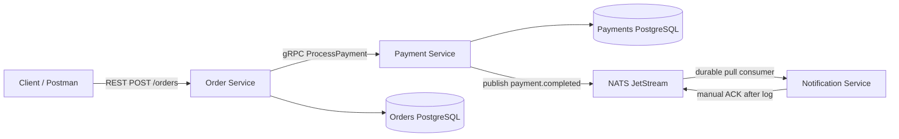

# AP2 Assignment 3 - Event-Driven Notifications with NATS JetStream

This project contains three Go microservices:

- `order-service` - REST API for creating and managing orders.
- `payment-service` - gRPC service that processes payments.
- `notification-service` - asynchronous consumer that sends payment notifications.

Assignment 2 gRPC communication is still used between Order and Payment. Assignment 3 adds an event-driven flow from Payment to Notification through NATS JetStream.

## Proto Repositories

- **Proto contracts:** https://github.com/Metsuk1/ProtocolAP2
- **Generated Go code:** https://github.com/Metsuk1/AP2_Generated

The project follows a contract-first approach. `PaymentRequest` includes `customer_email`, so the email is passed through the generated gRPC contract instead of gRPC metadata or hardcoded values.

## Architecture



Event subject:

```text
payment.completed
```

JetStream stream:

```text
PAYMENTS
```

Durable consumer:

```text
notification-service
```

## How to Run

Start the whole environment:

```bash
docker-compose up --build
```

This starts:

- `orders-db`
- `payments-db`
- `nats`
- `order-service`
- `payment-service`
- `notification-service`

Useful ports:

- Order REST API: `http://localhost:8080`
- Payment gRPC: `localhost:50051`
- Order gRPC streaming: `localhost:50052`
- NATS client port: `localhost:4222`
- NATS monitoring: `http://localhost:8222`

## Test the Event Flow

Create an order:

```http
POST http://localhost:8080/orders
Content-Type: application/json
```

Body:

```json
{
  "customer_id": "customer-1",
  "customer_email": "user@example.com",
  "item_name": "Laptop",
  "amount": 9999
}
```

Expected flow:

```text
Order Service creates the order.
Order Service calls Payment Service via gRPC.
Payment Service saves the payment in PostgreSQL.
Payment Service publishes payment.completed to NATS JetStream.
Notification Service consumes the event and prints an email log.
```

Expected notification log:

```text
[Notification] Sent email to user@example.com for Order #<order_id>. Amount: $99.99
```

## Event Payload

`payment-service` publishes JSON:

```json
{
  "event_id": "payment-id",
  "order_id": "order-id",
  "amount": 9999,
  "customer_email": "user@example.com",
  "status": "Authorized"
}
```

`event_id` is based on the payment ID and is also used as the JetStream message ID.

## Reliability and ACK Logic

NATS JetStream is used instead of plain NATS pub/sub because the assignment requires persistent delivery and manual acknowledgments.

Reliability choices:

- The `PAYMENTS` stream uses file storage, so messages can survive broker restarts.
- `payment-service` waits for a JetStream publish acknowledgement before treating event publishing as successful.
- `notification-service` uses a durable pull consumer named `notification-service`.
- Auto ACK is not used.
- A message is acknowledged only after the notification log is printed.
- Invalid messages are negatively acknowledged with `Nak()`, so they can be redelivered.

## Idempotency Strategy

`notification-service` keeps an in-memory set of processed `event_id` values.

Processing logic:

```text
If event_id was already processed:
    ACK the message and do not print the notification again.

If event_id is new:
    print the notification log,
    mark event_id as processed,
    ACK the message.
```

This prevents duplicate notifications during redelivery. For a production system, this in-memory store should be replaced with a persistent table, for example `processed_events(event_id)`.

## Graceful Shutdown

All services handle `SIGINT` and `SIGTERM`.

- `order-service` shuts down the HTTP server gracefully.
- `payment-service` stops the gRPC server gracefully and drains the NATS connection.
- `notification-service` stops consuming and drains the NATS connection.

## Local Development Commands

Build services locally:

```bash
cd order-service
go build ./...
```

```bash
cd payment-service
go build ./...
```

```bash
cd notification-service
go build ./...
```

Run only infrastructure:

```bash
docker-compose up orders-db payments-db nats
```

Then run services manually in separate terminals if needed.

