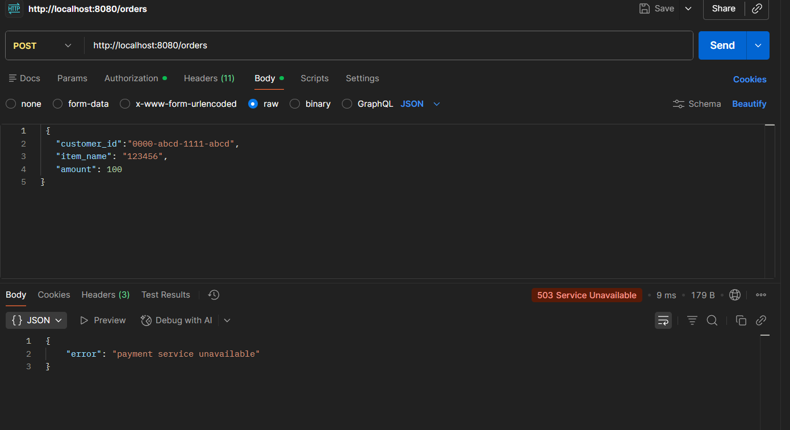
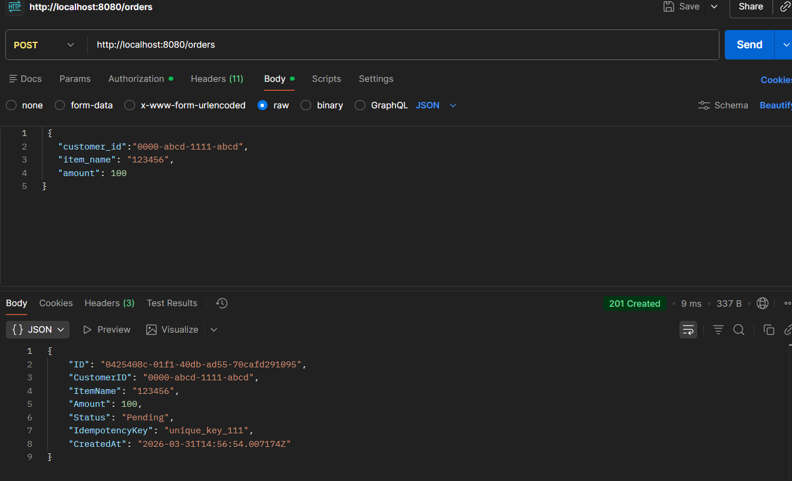
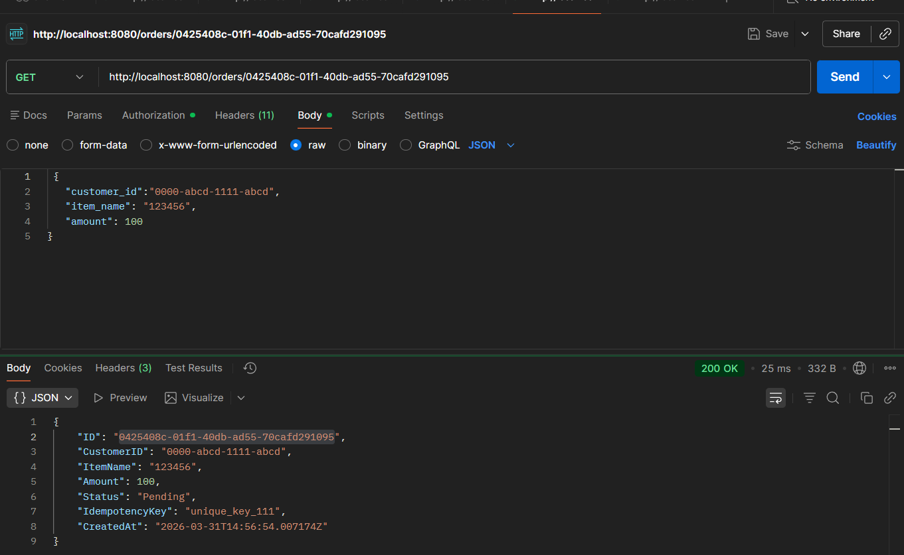
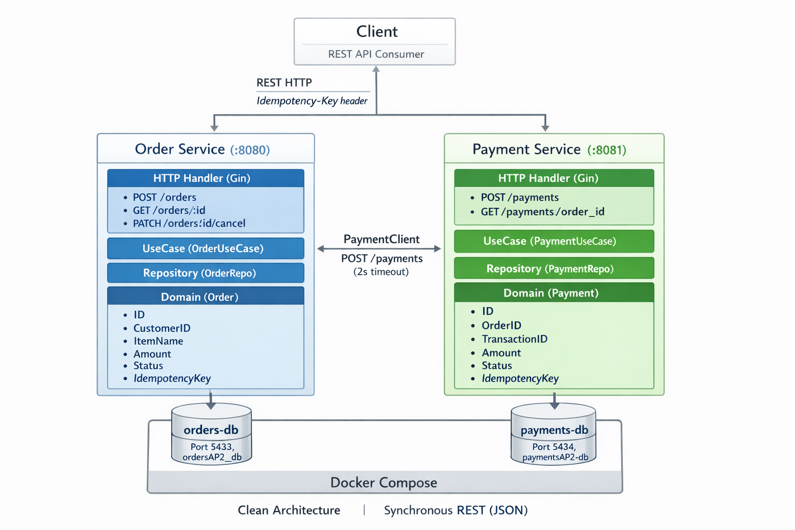

# AP2 Assignment 1 — Order & Payment Microservices

Two microservices built with Go, Gin, and PostgreSQL following Clean Architecture.

## Architecture

```
order-service (port 8080)  --->  payment-service (port 8081)
      |                                |
  orders-db (5433)               payments-db (5434)
```

Each service has its own PostgreSQL database. Order Service calls Payment Service via HTTP to process payments

## Project Structure

```
├── docker-compose.yml
├── order-service/
│   ├── cmd/order-service/main.go
│   ├── internal/
│   │   ├── domain/          # entities, repository & client interfaces
│   │   ├── usecase/         # business logic
│   │   ├── repository/      # PostgreSQL implementation
│   │   └── transport/http/  # handlers, routes, payment client
│   └── migrations/
└── payment-service/
    ├── cmd/payment-service/main.go
    ├── internal/
    │   ├── domain/
    │   ├── usecase/
    │   ├── repository/
    │   └── transport/http/
    └── migrations/
```

## How to Run

1. Start databases:
```bash
docker-compose up -d
```

2. Run Payment Service:
```bash
cd payment-service
go run cmd/payment-service/main.go
```

3. Run Order Service:
```bash
cd order-service
go run cmd/order-service/main.go
```

## API Endpoints
Order Service 8080 port
 POST - /orders - Create order          
 GET  -/orders/:id - Get order by id                
 PATCH - /orders/:id/cancel -Cancel order


Payment Service 8081 port       
POST -/payments - Create payment        
GET - /payments/:order_id -Get payment by order


## Screenshots

When payments-service unavailable: 

    


Succesfully Create Order:


Get By Id ORder:


Diagram:
